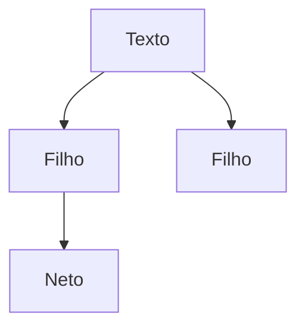
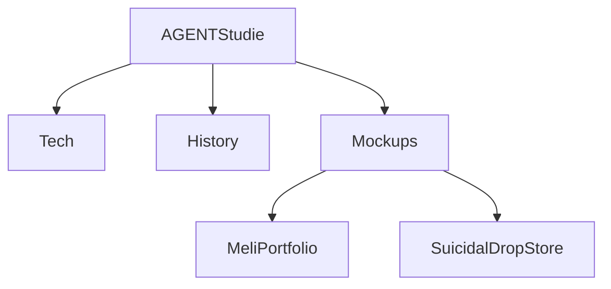
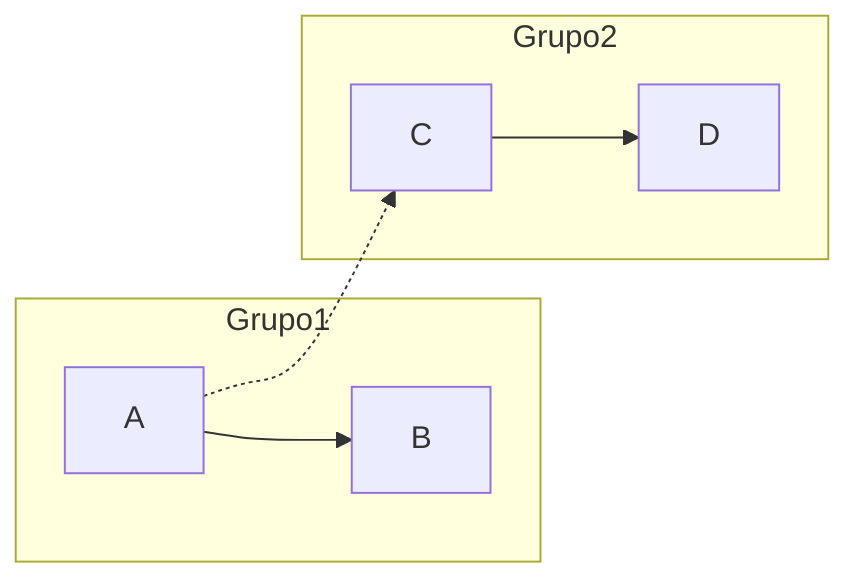
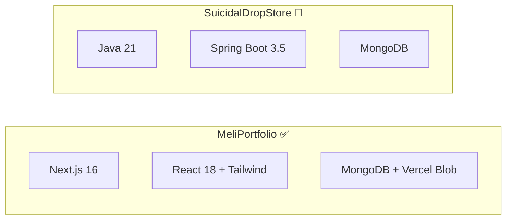
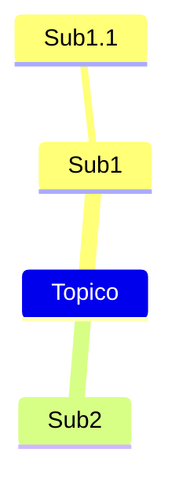
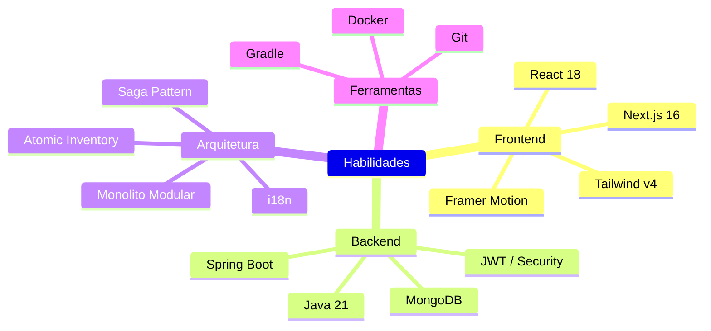
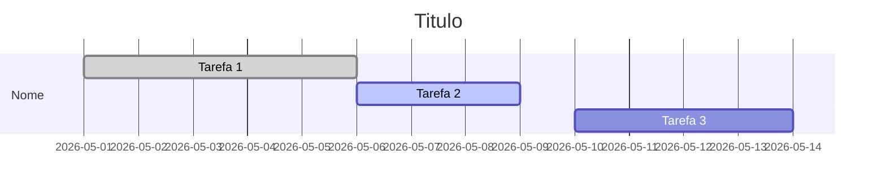
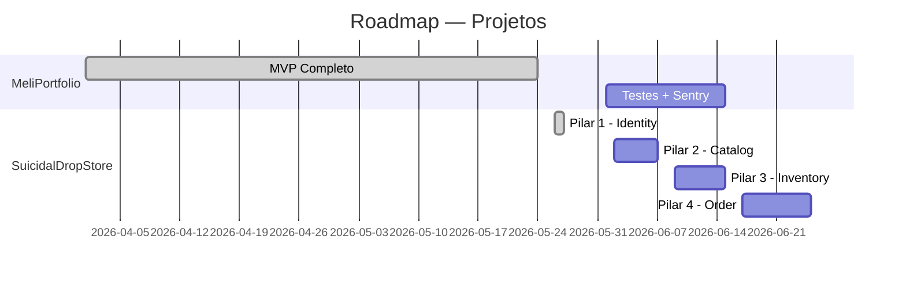
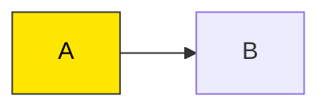
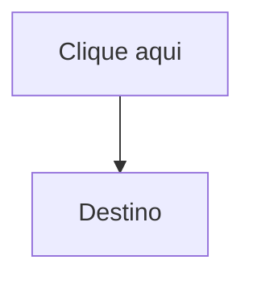

# MERMAID GUIDE — Tutorial de Diagramas

Guia rápido de Mermaid para usar nos arquivos `.MD` do repositório. O GitHub renderiza Mermaid nativamente em qualquer arquivo Markdown.

---

## 1. Graph (Árvores e Hierarquias)

### Sintaxe


- `TD` = Top-Down, `LR` = Left-Right
- `[Texto]` = retângulo, `(Texto)` = arredondado, `{Texto}` = losango

### Exemplo real do repositório


````markdown

````

---

## 2. Flowchart (Fluxos e Comparações)

### Sintaxe


- `subgraph` cria caixas agrupadas
- `.->` = linha tracejada, `==>` = linha grossa
- `direction TB` = dentro do subgraph, force Top-Bottom

### Exemplo real do repositório


````markdown

````

---

## 3. Mindmap (Mapas Mentais)

### Sintaxe


- Indentação define hierarquia
- `(` `)` = arredondado, `[` `]` = quadrado, `[[ ]]` = badge
- Não use `-->`, só indentação

### Exemplo real do repositório


````markdown

````

---

## 4. Gantt (Cronogramas)

### Sintaxe


- `:done` = concluído, `:active` = em andamento, `:crit` = crítico
- Duração em dias (`5d`), horas (`8h`), ou intervalo (`2026-05-01, 2026-05-10`)

### Exemplo real do repositório


````markdown

````

---

## Dicas Rápidas

### Cores e Estilos (graph/flowchart)


### Links nos nós


### Quebra de linha
Use `<br>` dentro dos colchetes:
```
A[Linha 1<br>Linha 2]
```

---

## Referência

- Documentação oficial: https://mermaid.js.org/syntax/
- Editor online: https://mermaid.live/
- Renderização: GitHub, GitLab, Notion, Obsidian (nativo)
