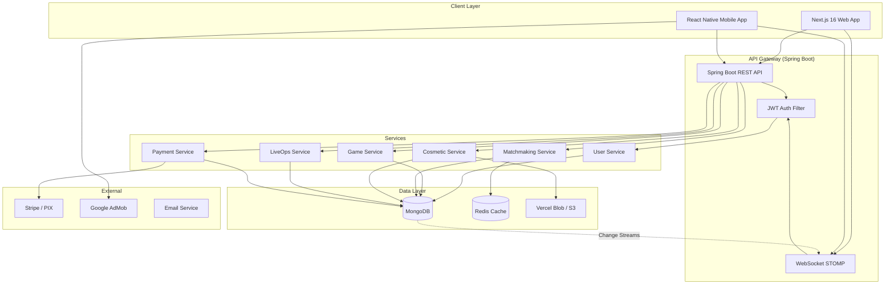
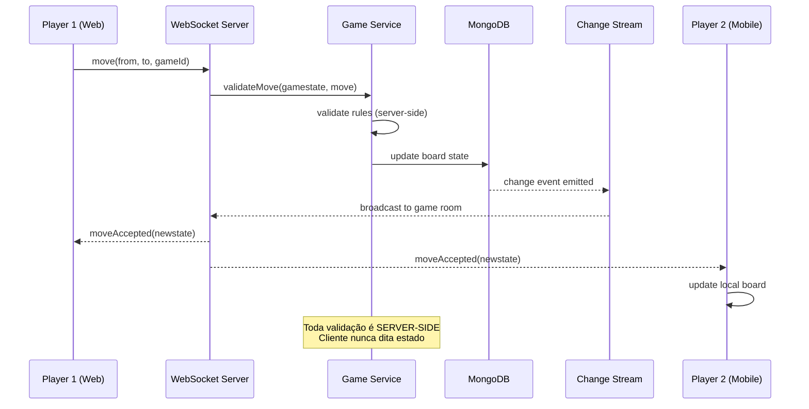
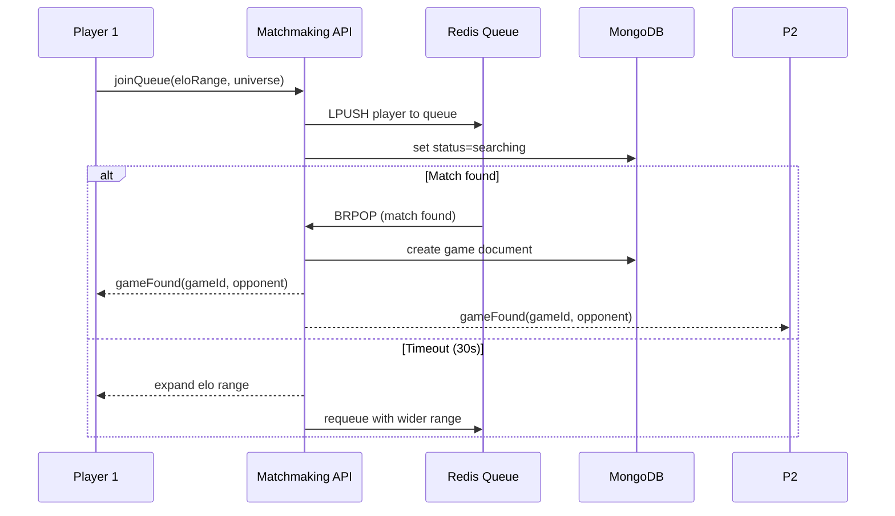

# Architecture — OmniChess

## Decisões Arquiteturais

| Decisão | Escolha (Adaptada) | Alternativas | Justificativa |
|---------|-------------------|-------------|---------------|
| Padrão | Monolito Modular | Microsserviços | Reaproveita padrão do SuicidalDropStore, deploy único |
| Web Framework | Next.js 16 App Router | CRA, Vite + React | SSR, API routes isoladas, Turbopack |
| Mobile | React Native (Expo) | Flutter, Kotlin Multiplatform | Reusa React já dominado, componentes compartilháveis |
| Backend | Java 21 + Spring Boot 3.5 | Node.js, Go | Performance, tipos fortes, já usado no SuicidalDropStore |
| Database | MongoDB + Change Streams | PostgreSQL, Firestore | Documentos flexíveis, real-time nativo, já usado |
| Real-time | WebSocket STOMP (Spring) + MongoDB Change Streams | Socket.io, Firestore onSnapshot | Padrão enterprise, baixa latência, controle total |
| Auth | JWT HMAC-SHA256 + Spring Security | Firebase Auth, OAuth2 | Já implementado, sem vendor lock-in |
| Cache | Redis (opcional, fase 4+) | In-memory, Memcached | Matchmaking queue, leaderboard, rate limiting |
| File Storage | Vercel Blob (Web) + S3-compatible (geral) | Firebase Storage, Cloudinary | Já usado no MeliPortfolio |
| State Frontend | Zustand + TanStack Query | Redux, Context API | Já usado, persist middleware, cache |
| Validação | Zod (frontend) + Bean Validation (backend) | Yup, Joi | Consistência entre front e back |
| Pagamentos | Stripe + PIX (via API bancária) | Mercado Pago, PayPal | Cobertura BR + internacional |
| Anúncios | Google AdMob (Mobile) | Unity Ads, Meta Audience | Padrão da indústria mobile |
| CI/CD | GitHub Actions | Vercel CI, Railway | Gratuito, flexível |

## Diagrama de Arquitetura do Sistema



## Fluxo de Dados: Jogada em Tempo Real



## Fluxo de Matchmaking



## Estrutura de Pacotes (Backend — Spring Boot)

```
com.omnichess.api/
├── ApiApplication.java
├── config/
│   ├── SecurityConfig.java
│   ├── JwtTokenProvider.java
│   ├── JwtAuthFilter.java
│   ├── WebSocketConfig.java
│   ├── MongoConfig.java
│   └── CorsConfig.java
├── common/
│   ├── exception/
│   │   ├── GlobalExceptionHandler.java
│   │   ├── GameException.java
│   │   └── InsufficientFundsException.java
│   └── util/
│       ├── ChessEngine.java        (validação server-side)
│       └── RatingCalculator.java   (Elo/MMR)
├── domain/
│   ├── user/
│   │   ├── controller/UserController.java
│   │   ├── service/UserService.java
│   │   ├── repository/UserRepository.java
│   │   ├── model/User.java
│   │   └── dto/UserDto.java
│   ├── game/
│   │   ├── controller/GameController.java
│   │   ├── service/GameService.java
│   │   ├── service/MatchmakingService.java
│   │   ├── repository/GameRepository.java
│   │   ├── model/Game.java
│   │   ├── model/Move.java
│   │   └── dto/GameDto.java
│   ├── cosmetic/
│   │   ├── controller/CosmeticController.java
│   │   ├── service/CosmeticService.java
│   │   ├── service/GachaService.java
│   │   ├── repository/CosmeticRepository.java
│   │   ├── model/Universe.java
│   │   ├── model/PlayerCosmetic.java
│   │   └── dto/CosmeticDto.java
│   ├── liveops/
│   │   ├── controller/LiveOpsController.java
│   │   ├── service/DailyRewardService.java
│   │   ├── service/BattlePassService.java
│   │   ├── service/EventService.java
│   │   ├── repository/LiveOpsRepository.java
│   │   └── model/BattlePass.java
│   └── payment/
│       ├── controller/PaymentController.java
│       ├── service/PaymentService.java
│       ├── service/AdRewardService.java
│       └── model/Transaction.java
└── websocket/
    ├── GameWebSocketHandler.java
    ├── MoveMessage.java
    └── WebSocketEventListener.java
```

## Armazenamento de Arquivos (Universos)

Cada "Universo/Dimensão" tem seus assets armazenados no Vercel Blob ou S3:

```
/universes/
├── cyberpunk-neon/
│   ├── preview.png
│   ├── board/
│   │   ├── tile-light.webp
│   │   ├── tile-dark.webp
│   │   └── board-texture.webp
│   ├── pieces/
│   │   ├── pawn.webp
│   │   ├── rook.webp
│   │   ├── knight.webp
│   │   ├── bishop.webp
│   │   ├── queen.webp
│   │   └── king.webp
│   ├── effects/
│   │   ├── move-highlight.webp
│   │   ├── capture-effect.webp
│   │   └── check-effect.webp
│   └── audio/
│       ├── bgm.mp3
│       └── move-sfx.mp3
├── grim-dark-fantasy/
├── retro-vaporwave/
├── cosmic-void/
└── ...
```

## Segurança

- **Validação server-side obrigatória**: toda jogada passa pelo Chess Engine no backend
- **JWT stateless** com claims: userId, role, subscription
- **Rate limiting** por IP/userId nos endpoints de API
- **Transações monetárias** com idempotency key (evita duplicação)
- **Audit log** de todas as ações de economia (compra, gacha, resgate)
- **MongoDB Validation** usando Schema Validation para integridade de documentos

## Considerações de Escala

| Estágio | Conexões Simultâneas | Estratégia |
|---------|---------------------|------------|
| MVP (Fase 1-2) | ~100 | Single instance Spring Boot + MongoDB Atlas M2 |
| Crescimento (Fase 3-4) | ~1.000 | Spring Boot cluster + MongoDB Atlas M10 + Redis |
| Escala (Fase 5+) | ~10.000+ | Horizontal scaling + Sharding MongoDB + CDN |
