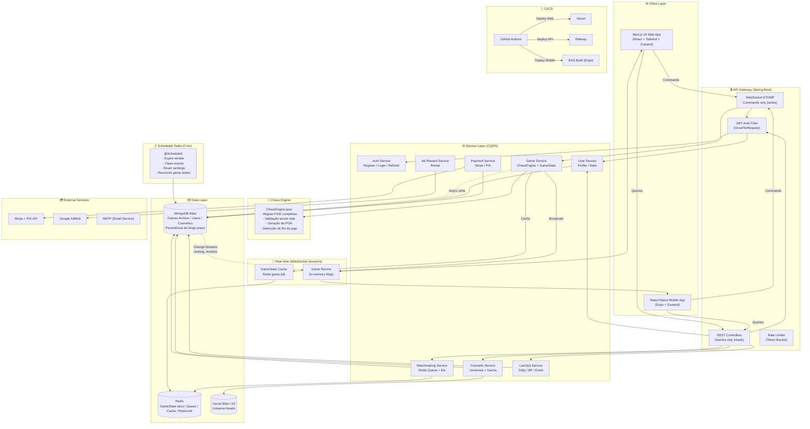
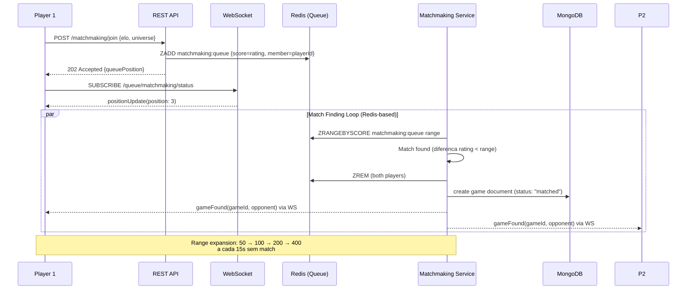
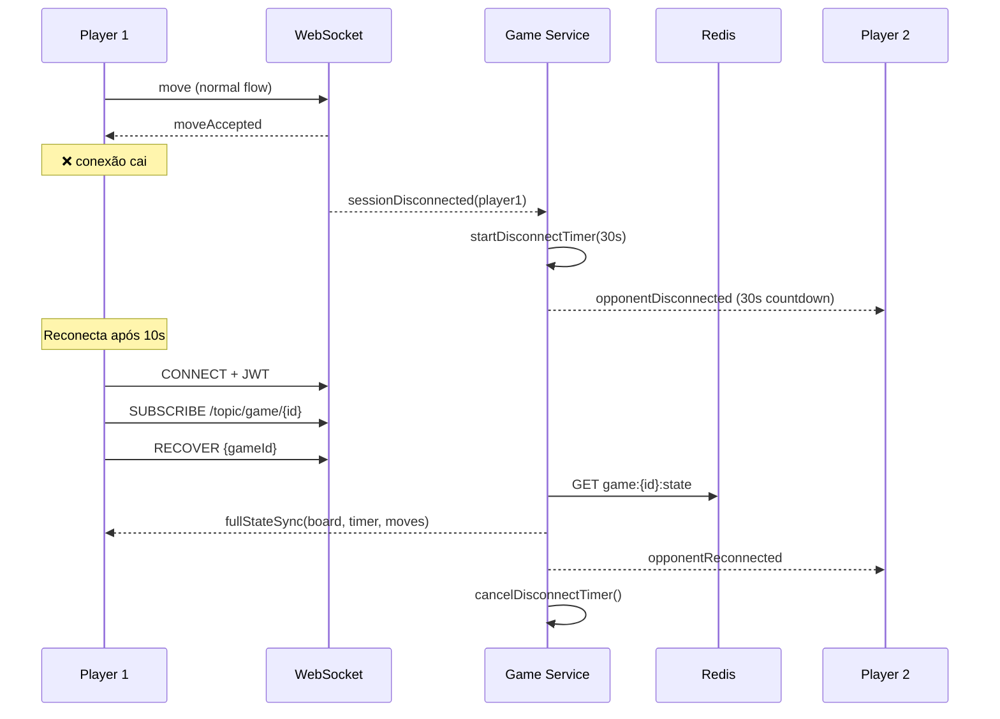

# Architecture — OmniChess

## Decisões Arquiteturais

| Decisão | Escolha (Adaptada) | Alternativas | Justificativa |
|---------|-------------------|-------------|---------------|
| Padrão | Monolito Modular | Microsserviços | Reaproveita padrão do SuicidalDropStore, deploy único |
| Web Framework | Next.js 16 App Router | CRA, Vite + React | SSR, API routes isoladas, Turbopack |
| Mobile | React Native (Expo) | Flutter, Kotlin Multiplatform | Reusa React já dominado, componentes compartilháveis |
| Backend | Java 21 + Spring Boot 3.5 | Node.js, Go | Performance, tipos fortes, virtual threads, já usado |
| Database | MongoDB + Change Streams | PostgreSQL, Firestore | Documentos flexíveis, já usado |
| Real-time | WebSocket STOMP (Spring) + GameState in-memory | Socket.io, Firebase | Baixa latência (<50ms), controle total |
| Game State Cache | Redis (obrigatório desde a Fase 2) | Apenas in-memory | Persistência entre instâncias, scale-out |
| Auth | JWT HMAC-SHA256 + Spring Security | Firebase Auth, OAuth2 | Já implementado, sem vendor lock-in |
| Cache | Redis (cache geral + rate limit + leaderboard) | In-memory, Memcached | Uso múltiplo desde o MVP |
| File Storage | Vercel Blob (Web) + S3-compatible (geral) | Firebase Storage, Cloudinary | Já usado no MeliPortfolio |
| State Frontend | Zustand + TanStack Query | Redux, Context API | Já usado, persist middleware, cache |
| Validação | Zod (frontend) + Bean Validation (backend) | Yup, Joi | Consistência entre front e back |
| Pagamentos | Stripe (com suporte a PIX nativo) | Mercado Pago, PayPal | Stripe já oferece PIX desde 2023 |
| Anúncios | Google AdMob (Mobile) | Unity Ads, Meta Audience | Padrão da indústria mobile |
| CI/CD | GitHub Actions | Vercel CI, Railway | Gratuito, flexível |
| Game Loop | Server-authoritative com timers gerenciados no backend | Cliente confiável | Anti-cheat, sincronia perfeita |

---

## 🚨 CORREÇÃO CRÍTICA: Fluxo de Jogada em Tempo Real

**Problema identificado na versão original:** O fluxo usava MongoDB Change Streams para propagar jogadas entre jogadores:

```
❌ Player → WS → GameService → MongoDB → Change Stream → Broadcast
```

Change Streams têm latência de ~50-200ms (polling do oplog), são assíncronas e sujeitas a backpressure. **Isso é inaceitável para um jogo de ação em tempo real.** Uma jogada de xadrez deve ser validada e transmitida em <50ms.

### Fluxo Correto (Otimizado)

```
✅ Player → WS → GameService (valida + estado em memória) → Broadcast direto → MongoDB (persistência assíncrona)
```

```mermaid
sequenceDiagram
    participant P1 as Player 1 (Web)
    participant WS as WebSocket Server
    participant GS as Game Service
    participant MEM as In-Memory GameState
    participant REDIS as Redis Cache
    participant MDB as MongoDB (Async)
    participant P2 as Player 2 (Mobile)

    P1->>WS: move(from, to, gameId)
    WS->>GS: validateMove(gamestate, move)

    critical Validação Síncrona (obrigatória)
        GS->>GS: 1. Verificar turno correto
        GS->>GS: 2. Validar regras FIDE (ChessEngine)
        GS->>GS: 3. Atualizar estado em memória
        GS->>MEM: updateBoard(newState)
        GS->>GS: 4. Calcular timers (server-side)
    end

    parallel Broadcast + Persistência
        GS-->>P1: moveAccepted(newState, timer)
        GS-->>P2: moveAccepted(newState, timer)
        and
        GS->>REDIS: SET game:{id} (TTL=2h)
        GS->>MDB: update game state (async, fire-and-forget)
    end

    Note over GS: Toda validação é SERVER-SIDE<br>Cliente NUNCA dita estado<br>MongoDB não está no caminho crítico
```

### Por que essa mudança é importante?

| Abordagem | Latência | Complexidade | Resiliência |
|-----------|----------|-------------|-------------|
| ❌ Change Streams | ~50-200ms | Média | Frágil (depende do oplog) |
| ✅ In-memory + Broadcast | ~1-5ms | Baixa | Robusta (state em Redis) |

**MongoDB Change Streams** continuam sendo usadas, mas **apenas para eventos não-críticos**:
- Notificar ranking atualizado
- Broadcast de eventos sazonais
- Sincronização entre instâncias do servidor

---

## Diagrama de Arquitetura do Sistema (Otimizado)



## Fluxo de Matchmaking (Otimizado com Redis + WS)



## 🎮 Gerenciamento de Timer (Server-Side)

**Problema:** Timers controlados pelo cliente são vulneráveis a cheating.

**Solução:** O servidor gerencia o tempo restante de cada jogador:

```java
public class GameTimer {
    private long whiteTimeMs;      // tempo restante do branco
    private long blackTimeMs;      // tempo restante do preto
    private long lastMoveTimestamp; // timestamp server-side da última jogada
    private String currentTurn;     // "white" | "black"

    /**
     * Ao receber uma jogada válida:
     * 1. Calcula tempo decorrido desde a última jogada
     * 2. Subtrai do timer do jogador que moveu
     * 3. Troca o turno
     * 4. Retorna timers atualizados no broadcast
     */
    public TimerSnapshot onMoveReceived() {
        long now = System.currentTimeMillis();
        long elapsed = now - lastMoveTimestamp;

        if ("white".equals(currentTurn)) {
            whiteTimeMs -= elapsed;
            if (whiteTimeMs <= 0) return TimerSnapshot.timeout("black");
        } else {
            blackTimeMs -= elapsed;
            if (blackTimeMs <= 0) return TimerSnapshot.timeout("white");
        }

        lastMoveTimestamp = now;
        currentTurn = "white".equals(currentTurn) ? "black" : "white";
        return TimerSnapshot.active(whiteTimeMs, blackTimeMs, currentTurn);
    }
}
```

**Time Controls suportados:**
| Modalidade | Tempo inicial | Incremento por jogada |
|-----------|--------------|----------------------|
| Bullet | 1 min | 0s |
| Blitz | 5 min | 2s |
| Rápido | 10 min | 5s |
| Clássico | 30 min | 10s |

## 🔄 Reconexão e State Recovery

Jogadores podem perder conexão. Estratégia de recovery:



## Estrutura de Pacotes (Backend — Spring Boot)

```
com.omnichess.api/
├── ApiApplication.java
├── config/
│   ├── SecurityConfig.java
│   ├── JwtTokenProvider.java
│   ├── JwtAuthFilter.java
│   ├── WebSocketConfig.java
│   ├── MongoConfig.java
│   └── CorsConfig.java
├── common/
│   ├── exception/
│   │   ├── GlobalExceptionHandler.java
│   │   ├── GameException.java
│   │   └── InsufficientFundsException.java
│   └── util/
│       ├── ChessEngine.java        (validação server-side)
│       └── RatingCalculator.java   (Elo/MMR)
├── domain/
│   ├── user/
│   │   ├── controller/UserController.java
│   │   ├── service/UserService.java
│   │   ├── repository/UserRepository.java
│   │   ├── model/User.java
│   │   └── dto/UserDto.java
│   ├── game/
│   │   ├── controller/GameController.java
│   │   ├── service/GameService.java
│   │   ├── service/MatchmakingService.java
│   │   ├── repository/GameRepository.java
│   │   ├── model/Game.java
│   │   ├── model/Move.java
│   │   └── dto/GameDto.java
│   ├── cosmetic/
│   │   ├── controller/CosmeticController.java
│   │   ├── service/CosmeticService.java
│   │   ├── service/GachaService.java
│   │   ├── repository/CosmeticRepository.java
│   │   ├── model/Universe.java
│   │   ├── model/PlayerCosmetic.java
│   │   └── dto/CosmeticDto.java
│   ├── liveops/
│   │   ├── controller/LiveOpsController.java
│   │   ├── service/DailyRewardService.java
│   │   ├── service/BattlePassService.java
│   │   ├── service/EventService.java
│   │   ├── repository/LiveOpsRepository.java
│   │   └── model/BattlePass.java
│   └── payment/
│       ├── controller/PaymentController.java
│       ├── service/PaymentService.java
│       ├── service/AdRewardService.java
│       └── model/Transaction.java
└── websocket/
    ├── GameWebSocketHandler.java
    ├── MoveMessage.java
    └── WebSocketEventListener.java
```

## Armazenamento de Arquivos (Universos)

Cada "Universo/Dimensão" tem seus assets armazenados no Vercel Blob ou S3:

```
/universes/
├── cyberpunk-neon/
│   ├── preview.png
│   ├── board/
│   │   ├── tile-light.webp
│   │   ├── tile-dark.webp
│   │   └── board-texture.webp
│   ├── pieces/
│   │   ├── pawn.webp
│   │   ├── rook.webp
│   │   ├── knight.webp
│   │   ├── bishop.webp
│   │   ├── queen.webp
│   │   └── king.webp
│   ├── effects/
│   │   ├── move-highlight.webp
│   │   ├── capture-effect.webp
│   │   └── check-effect.webp
│   └── audio/
│       ├── bgm.mp3
│       └── move-sfx.mp3
├── grim-dark-fantasy/
├── retro-vaporwave/
├── cosmic-void/
└── ...
```

## Segurança

- **Validação server-side obrigatória**: toda jogada passa pelo Chess Engine no backend
- **JWT stateless** com claims: userId, role, subscription
- **Rate limiting** por IP/userId nos endpoints de API
- **Transações monetárias** com idempotency key (evita duplicação)
- **Audit log** de todas as ações de economia (compra, gacha, resgate)
- **MongoDB Validation** usando Schema Validation para integridade de documentos

## Considerações de Escala

| Estágio | Conexões Simultâneas | Estratégia |
|---------|---------------------|------------|
| MVP (Fase 1-2) | ~100 | Single instance Spring Boot + MongoDB Atlas M2 |
| Crescimento (Fase 3-4) | ~1.000 | Spring Boot cluster + MongoDB Atlas M10 + Redis |
| Escala (Fase 5+) | ~10.000+ | Horizontal scaling + Sharding MongoDB + CDN |
