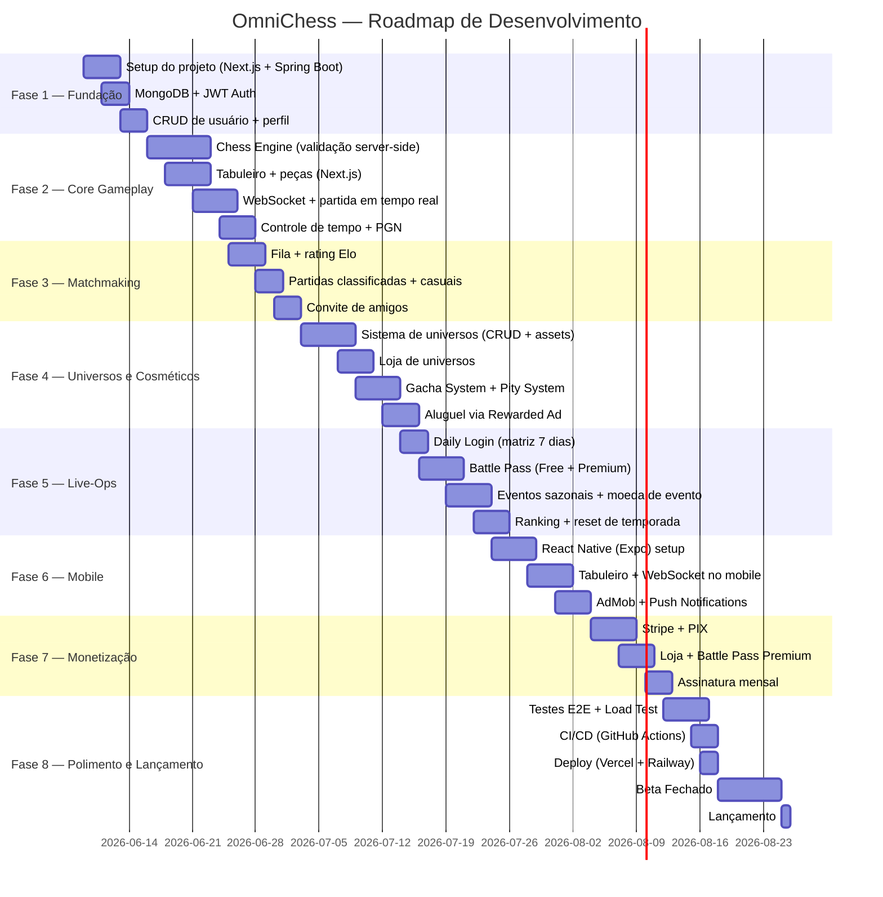

# Roadmap — OmniChess

Roadmap de desenvolvimento em 8 fases. Cada fase é um marco entregável e testável.

---

## Detalhamento por Fase

### Fase 1 — Fundação (11 dias)
**Objetivo:** Projeto rodando localmente com autenticação e banco de dados.

| Tarefa | Entrega | Dependências |
|--------|---------|-------------|
| Next.js 16 App Router + Tailwind v4 | Página inicial, dark mode | — |
| Spring Boot 3.5 + Gradle | API rodando | — |
| MongoDB Atlas (M2) | Conexão estabelecida | — |
| JWT + Spring Security | Register + Login funcionando | Spring Boot |
| User profile | Avatar, username, rating | Auth |
| Docker Compose | MongoDB local para dev | — |

**Critério de Sucesso:** Usuário consegue registrar, logar e ver o perfil.

---

### Fase 2 — Core Gameplay (21 dias)
**Objetivo:** Duas pessoas conseguem jogar xadrez em tempo real.

| Tarefa | Entrega | Dependências |
|--------|---------|-------------|
| Chess Engine (Java) | Validação de todas as regras FIDE | Fase 1 |
| Tabuleiro interativo | Peças arrastáveis, highlight de movimentos | Next.js |
| WebSocket STOMP | Partida em tempo real | Spring Boot, Chess Engine |
| Controle de tempo | Clássico (30min), Rápido (10min), Blitz (5min), Bullet (1min) | WebSocket |
| PGN exportável | Histórico da partida | Chess Engine |

**Critério de Sucesso:** Dois jogadores completam uma partida com controle de tempo.

---

### Fase 3 — Matchmaking (10 dias)
**Objetivo:** Jogadores encontram oponentes automaticamente.

| Tarefa | Entrega | Dependências |
|--------|---------|-------------|
| Redis para fila | Matchmaking queue | Fase 1 |
| Sistema Elo | Cálculo pós-partida | Fase 2 |
| Fila com range | Expansão gradual de rating | Redis |
| Convite de amigos | Partida direta | Fase 2 |

**Critério de Sucesso:** Jogador entra na fila e encontra oponente em <30s.

---

### Fase 4 — Universos e Cosméticos (19 dias)
**Objetivo:** Sistema de personalização completo com gacha.

| Tarefa | Entrega | Dependências |
|--------|---------|-------------|
| CRUD de universos | Admin upload de assets | Fase 1 |
| Preview 3D | Visualização do universo | Next.js |
| Loja | Compra com moedas | Fase 3 |
| Gacha + Pity System | Abertura de caixa com garantia | Fase 4 (Loja) |
| Aluguel por Ad | 24h de universo grátis | Fase 4 (Loja) |

**Critério de Sucesso:** Jogador compra, abre caixa e equipa um universo lendário.

---

### Fase 5 — Live-Ops (17 dias)
**Objetivo:** Sistema de retenção e engajamento contínuo.

| Tarefa | Entrega | Dependências |
|--------|---------|-------------|
| Daily Login | Matriz 7 dias com streak | Fase 1 |
| Battle Pass | 50 níveis, Free + Premium | Fase 3 |
| Eventos | Temporários com moeda própria | Fase 5 (Battle Pass) |
| Ranking | Global + semanal + reset | Fase 3 |

**Critério de Sucesso:** Jogador completa 7 dias de login e sobe 10 níveis no Battle Pass.

---

### Fase 6 — Mobile (14 dias)
**Objetivo:** App React Native com todas as funcionalidades do Web.

| Tarefa | Entrega | Dependências |
|--------|---------|-------------|
| Expo setup | App rodando em iOS/Android | Fase 2 |
| Tabuleiro touch | Arrastar peças no mobile | Fase 2 |
| WebSocket mobile | Partidas em tempo real | Fase 2 |
| AdMob | Rewarded ads funcionando | Fase 6 |
| Push notifications | Convite, daily reward, evento | Fase 5 |

**Critério de Sucesso:** Jogador joga uma partida completa no celular.

---

### Fase 7 — Monetização (12 dias)
**Objetivo:** Sistema de pagamentos implementado e testado.

| Tarefa | Entrega | Dependências |
|--------|---------|-------------|
| Stripe integration | Cartão de crédito | Fase 4 |
| PIX | Pagamento instantâneo BR | Stripe ou API bancária |
| Premium Battle Pass | Compra dentro do jogo | Fase 5 |
| Assinatura | OmniCrystals mensais | Fase 7 |

**Critério de Sucesso:** Usuário compra Battle Pass Premium via PIX e recebe os itens.

---

### Fase 8 — Polimento e Lançamento (15 dias)
**Objetivo:** Jogo pronto para beta público.

| Tarefa | Entrega | Dependências |
|--------|---------|-------------|
| Testes E2E (Cypress + Detox) | Fluxos críticos testados | Fase 1-7 |
| Load test (k6/Gatling) | 1000 jogos simultâneos | Fase 2-3 |
| CI/CD GitHub Actions | Deploy automático | Fase 1 |
| Deploy Vercel (Web) + Railway (API) | Produção | Fase 1-7 |
| Beta fechado | 100 convidados | Tudo |
| Lançamento | Público geral | Beta |

**Critério de Sucesso:** 100 jogadores simultâneos sem queda de performance.

---

## Marcos Resumidos

| Fase | Período | Dias | Marco |
|------|---------|------|-------|
| **F1** | 09/jun — 19/jun | 11 | ✅ Auth + perfil rodando |
| **F2** | 16/jun — 06/jul | 21 | 🏆 Partida em tempo real completa |
| **F3** | 25/jun — 04/jul | 10 | 🔍 Matchmaking funcionando |
| **F4** | 03/jul — 21/jul | 19 | 🎨 Universos + Gacha no ar |
| **F5** | 14/jul — 30/jul | 17 | 📅 Live-Ops completo |
| **F6** | 24/jul — 06/ago | 14 | 📱 App mobile lançado |
| **F7** | 04/ago — 15/ago | 12 | 💳 Monetização funcionando |
| **F8** | 12/ago — 25/ago | 15 | 🚀 Lançamento público |
| **Total** | **09/jun — 25/ago** | **~78 dias** | |

---

## Estrutura de Custo Estimado (Mensal)

| Recurso | Plano | Custo |
|---------|-------|-------|
| MongoDB Atlas | M2 (2GB RAM, 20GB storage) | ~$15/mês |
| Redis | Redis Cloud (30MB) | Grátis |
| Vercel | Pro (equipe) | ~$20/mês |
| Railway | Developer (5 containers) | ~$5/mês |
| Vercel Blob | 5GB storage + 50GB bandwidth | ~$1/mês |
| Stripe | 2.9% + $0.30 por transação | Variável |
| Total | MVP | ~$41/mês |
