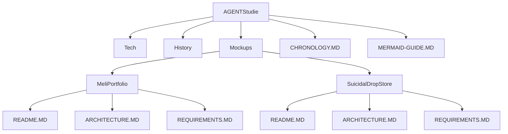
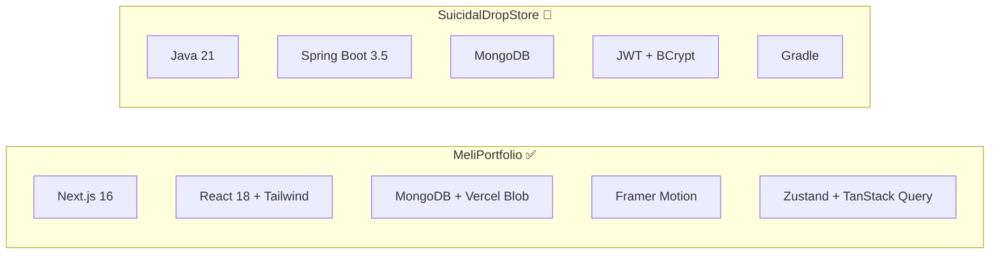
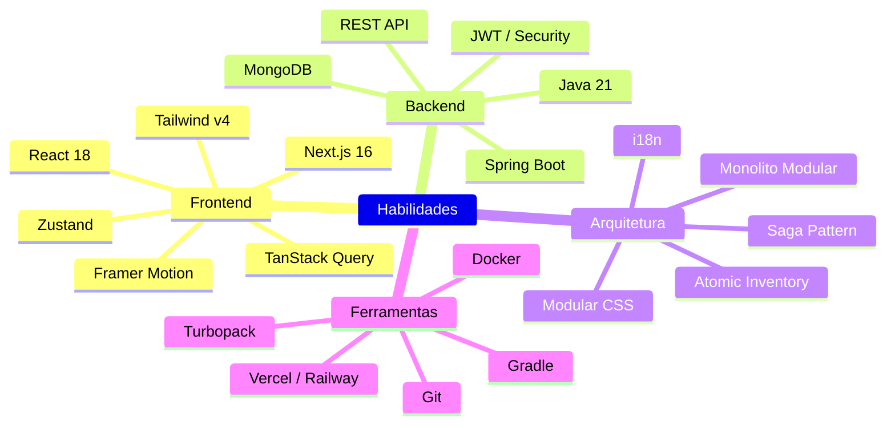
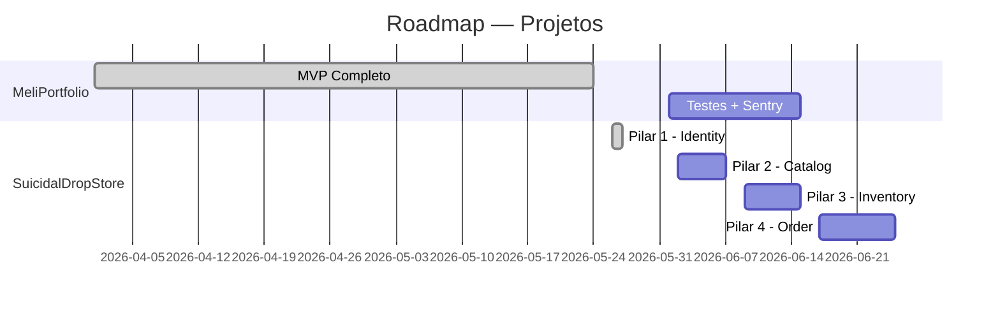

# AGENTStudie 🧠

Repositório pessoal de estudos e pesquisas — centralizando descobertas técnicas, análises históricas, fichamentos de livros, mockups de projetos e documentação arquitetural.

> "Estudar é organizar o pensamento."

## Estrutura

| Diretório | Finalidade |
|-----------|------------|
| `Tech/` | Estudos de tecnologia (frameworks, linguagens, ferramentas) |
| `History/` | Estudos históricos, livros, fatos e períodos |
| `Mockups/` | Projetos, esquemas, protótipos e templates |

Cada categoria possui seu próprio `_index_.MD` com a lista completa de tópicos.

## Como usar este repositório

1. Consulte o [`AGENTS.MD`](./AGENTS.MD) para as convenções e regras
2. Verifique o [`CHRONOLOGY.MD`](./CHRONOLOGY.MD) para saber o que está pendente ou agendado
3. Escolha a categoria adequada para seu estudo
4. Crie um diretório seguindo o padrão PascalCase
5. Documente conforme os templates disponíveis

---

## 🗺️ Mapa de Projetos

### 1. Árvore do Repositório

### 2. Comparativo entre Projetos

| Aspecto | MeliPortfolio | SuicidalDropStore |
|---------|--------------|-------------------|
| Tipo | Full-stack + CMS | Backend API |
| Linguagem | JavaScript / React | Java 21 |
| Framework | Next.js 16 | Spring Boot 3.5 |
| Banco | MongoDB Atlas | MongoDB Atlas |
| Auth | Bearer Token (API Key) | JWT HMAC-SHA256 |
| Armazenamento | Vercel Blob | N/A |
| Estado | ✅ Quase completo | 🔧 Pilar 1/4 |
| Commits | 20 | 1 |

### 3. Stack por Projeto

### 4. Mapa de Habilidades

### 5. Roadmap

### 6. Progresso Geral

| Projeto | Status | Progresso |
|---------|--------|-----------|
| MeliPortfolio | ✅ Quase completo | █████████░ 90% |
| SuicidalDropStore | 🔧 Em desenvolvimento | ██░░░░░░░░ 25% |
| Tech/ | ⬜ Aguardando estudos | ░░░░░░░░░░ 0% |
| History/ | ⬜ Aguardando estudos | ░░░░░░░░░░ 0% |

### ➕ Como Adicionar um Novo Projeto ao Mapa

1. Crie a pasta em `Mockups/Projects/<PascalCaseName>/`
2. Siga o template com `README.MD`, `ARCHITECTURE.MD`, `REQUIREMENTS.MD`
3. Adicione 1 linha na tabela de projetos no `Mockups/_index_.MD`
4. Atualize este arquivo:
   - 1 linha na seção de progresso (passo 6)
   - 1 subgraph no diagrama de stacks (passo 3) — se trouxer stack diferente
   - 1 ramo no mindmap (passo 4) — se trouxer habilidade nova
5. Registre no [`CHRONOLOGY.MD`](./CHRONOLOGY.MD) com `[MARCO]`

---

## 📚 Guias

- [`AGENTS.MD`](./AGENTS.MD) — Regras e convenções do repositório
- [`MERMAID-GUIDE.MD`](./MERMAID-GUIDE.MD) — Tutorial de diagramas Mermaid
- [`CHRONOLOGY.MD`](./CHRONOLOGY.MD) — Cronograma e histórico de atividades

---

📅 Criado em: Maio 2026
